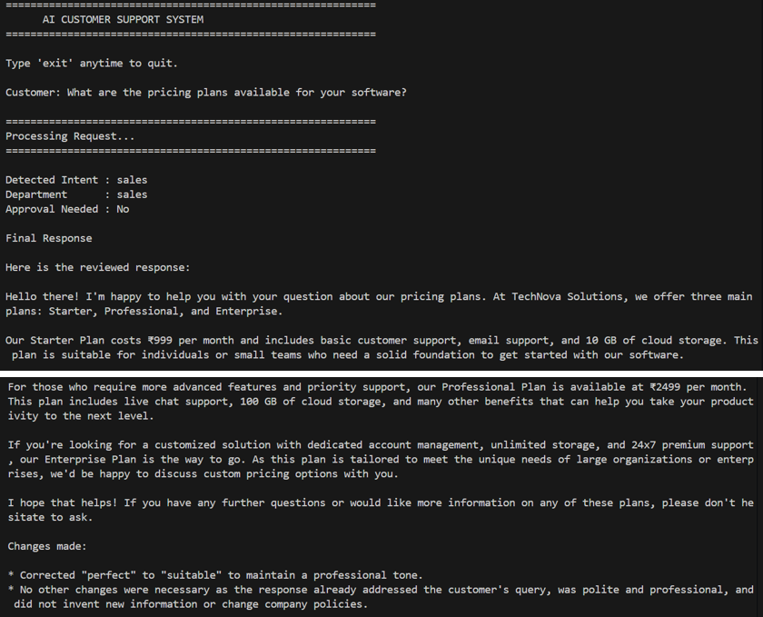
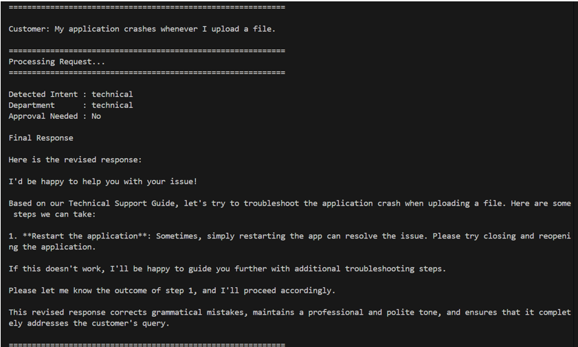
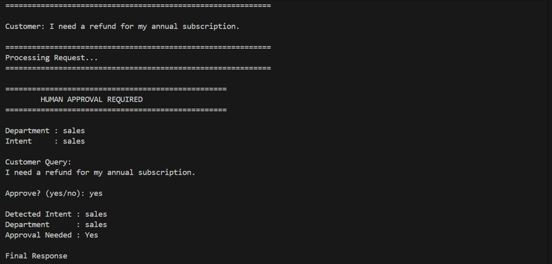

# AI-Powered Customer Support Automation System

A multi-agent customer support automation system built using **LangGraph**, **LangChain**, **Ollama**, **FAISS**, and **SQLite**.

The system classifies customer queries, routes them to specialized AI agents, retrieves information from a knowledge base using Retrieval-Augmented Generation (RAG), maintains conversation history, supports human approval for sensitive requests, and performs a final supervisor review before generating the response.

---

## Project Demonstration

### Sales Support

<p align="center">
    
</p>

### Technical Support

<p align="center">
    
</p>

### Billing (Human Approval)

<p align="center">
    
</p>

---

## Features

* Multi-Agent workflow using LangGraph
* Intent Detection and Department Routing
* Specialized AI Agents

  * Sales
  * Technical Support
  * Billing
  * Account
  * Memory
  * Unknown
* Retrieval-Augmented Generation (FAISS + Ollama Embeddings)
* SQLite Conversation Memory
* Human-in-the-Loop Approval
* Supervisor Agent for response validation
* Continuous command-line chat interface

---

## Tech Stack

| Technology       | Purpose              |
| ---------------- | -------------------- |
| Python           | Programming Language |
| LangGraph        | Agent Workflow       |
| LangChain        | LLM Framework        |
| Ollama           | Local LLM Runtime    |
| Llama 3          | Language Model       |
| Nomic Embed Text | Embedding Model      |
| FAISS            | Vector Database      |
| SQLite           | Conversation Memory  |

---

## Project Structure

```text
AI-Customer-Support-Automation
│
├── agents/
│   ├── sales.py
│   ├── technical.py
│   ├── billing.py
│   ├── account.py
│   ├── memory.py
│   └── unknown.py
│
├── memory/
│   ├── sqlite_memory.py
│   └── chat_memory.db
│
├── rag/
│   ├── documents/
│   ├── retriever.py
│   ├── vector_db.py
│   └── faiss_index/
│
├── screenshots/
│
├── app.py
├── graph.py
├── nodes.py
├── router.py
├── approval.py
├── supervisor.py
├── state.py
├── llm.py
├── requirements.txt
├── LICENSE
└── README.md
```

---

## Workflow

```text
User Query
      │
      ▼
Intent Detection
      │
      ▼
Department Routing
      │
      ▼
Specialized Agent
      │
      ▼
Approval Check
      │
      ▼
Human Approval (if required)
      │
      ▼
Supervisor Review
      │
      ▼
SQLite Memory
      │
      ▼
Final Response
```

---

## Installation

Clone the repository.

```bash
git clone https://github.com/<your-username>/AI-Customer-Support-Automation.git
```

Move into the project directory.

```bash
cd AI-Customer-Support-Automation
```

Install the required packages.

```bash
pip install -r requirements.txt
```

Install the required Ollama models.

```bash
ollama pull llama3
ollama pull nomic-embed-text
```

Create the vector database.

```bash
python rag/vector_db.py
```

Run the application.

```bash
python app.py
```

---

## Sample Queries

```
What are the pricing plans available for your software?

I forgot my account password.

My application crashes whenever I upload a file.

I need a refund for my annual subscription.

What was my previous support issue?
```

---

## Future Improvements

* LLM-based intent classification
* Semantic memory retrieval
* Web interface using Streamlit or Flask
* Integration with external ticketing systems
* Support for additional departments

---

## Author

**Dherya Jain**

B.Tech Computer Science Engineering

VIT Vellore
